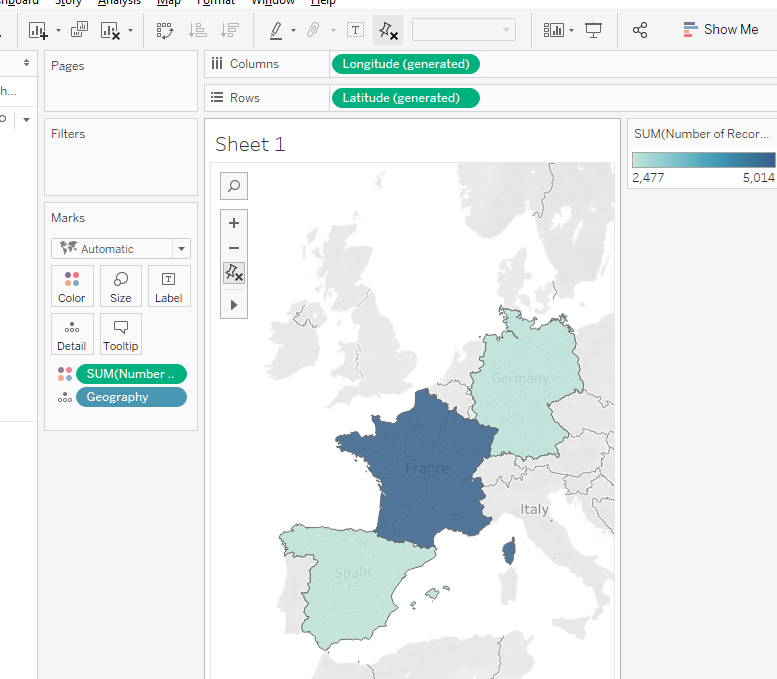

# Data Science A-Z

Link: https://www.udemy.com/datascience/learn/lecture/3473820#overview

## Domains of Data Science

* Statistics: see <a href="../'Statistics Refresher'/">Statistics Refresher Course</a>
    * Separate random noise from actual trend
    * Create models that classify population and provide reliable forecasts
* Vizualization
* Data Mining: interrogating data, looking for trends, anomalies
* Database & Data process: clearning, store, manipulate data
* Teaching computers how to learn without being explicitely programmed
    * Neurocomputing
    * Machine Learning
    * Pattern recognition
* Communication
* Presentation
* Domain Knowledge
* Real Life Practice
* Programming
* Creativity

## Part 1 - Vizualisation for Data Mining

### Introduction to Tableau

* Data can come from many files and you can join data from different files (joining, merge, ...).
* You can use many different types of files such as CSV, Excel PDF, SAP, ...

* Dimensions & Measures:
    * Dimensions: Independent variables. By default, categorical and qualitative data
    * Measures: Dependent variables (grouped by independent variables). By default, numerical data
* Dashboard is a combination of worksheets
* Story is a combination of worksheets and dashboards

* Possible to create Calculated Field from existing fields

* Possible to create map based on a Geographic Field (need to be recognized or setup by hand in Tableau)

* Possible to work with aliases, ie to translate 0/1 to "Exited"/Stayed" for example => via Aliases dropdown menu by right clicking on the dimension

* You can add a reference line by right clicking on the vertical axis

### Data Mining with Tableau

#### Very quick AB Test Strategy (Visual)

* Quick and dirty way to do AB test but statistical significance is not analyzed

* Ex: Customers that leaves a bank => what is the socio demographic of this movement ?
* AB test with gender
    * Display % instead of value for data labels and then replace the rows data with the data label data to have a maximized bar chart

    

    In this AB test, we could say that women are more likely to leave the bank, but we would also have to check for statistical significance

* If you see big anomalies, check the relative numbers of elements. If there is a big difference, you have to do some statistical test to see if there is really a change.

* In the previous category test, you can say that there is a better stickiness when customer have 2 instead of 1 product, but you can't say anything further as the sample size for 3 and 4 is disproportionate. You need to do more statistical test to see if the change is statistically significant.

* Validation
    * You want to find a variable that you know for sure does not influence the end result. Ex: last digit of Customer Id
    * If there is no skewness in the data, we should question our approach

    

#### Advanced Data Mining with Tableau

* Full-fledged statistical analysis

* Creating bins & Visualizing distributions
* Creating a classification test for a numerical variable
* Combining two charts and working with them in Tableau
* Validating Tableau Data Mining with a Chi-Squared test
* Chi-Squared test when there is more than 2 categories
* Visualising Balance and Estimated Salary distribution
* Chi-Squared Test

## Part 2 - Modelling

### Stats Refresher

### Simple Linear Regression

### Multiple Linear Regression

### Logistic Regression

## Part 3 - Data Preparation

### Business Intelligence (BI) Tools

### ETL

#### Phase 1 - Data Wrangling before the load

#### Phase 2 - Step-by-step guide to uploading data using SSIS

## Part 4 - Communication & Presentation